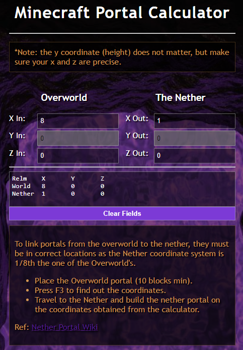

# Minecraft Portal Calculator [App](https://deniszholob.github.io/minecraft-portal-calculator/)

Simple calculator I made years ago to determine coordinates for Minecraft portals in the Overworld and the Nether.

UI needs some modern polish, but otherwise functional.

Ref: [Nether Portal Wiki](https://minecraft.fandom.com/wiki/Nether_Portal)

# Support Me

If you find the cheat sheet or the source code useful, consider:

- Donating Ko-fi: https://ko-fi.com/deniszholob
- Supporting on Patreon: https://www.patreon.com/deniszholob

# Screenshot

